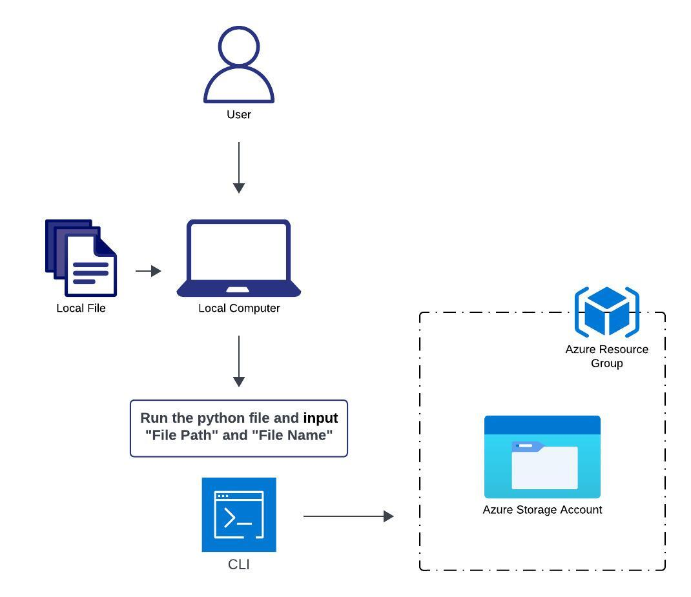

# Cloud CLI Uploader - Python

The Cloud CLI Uploader takes a file from your local system and will upload it to an Azure Storage Account all through a Command Line Interface (CLI). It automates the process of file uploads to Azure.



> <sub>To get started, you first need to have a Microsoft Azure account. If you don't have one, you can create a free account [here.](https://azure.microsoft.com/en-us/free/search/?&ef_id=_k_Cj0KCQiA4NWrBhD-ARIsAFCKwWv39zVXs4ww7bj_IGmTJngZol8ZX835NOuvRgv7ygSk_rEe9lnrcGcaAg2vEALw_wcB_k_&OCID=AIDcmm5edswduu_SEM__k_Cj0KCQiA4NWrBhD-ARIsAFCKwWv39zVXs4ww7bj_IGmTJngZol8ZX835NOuvRgv7ygSk_rEe9lnrcGcaAg2vEALw_wcB_k_&gad_source=1&gclid=Cj0KCQiA4NWrBhD-ARIsAFCKwWv39zVXs4ww7bj_IGmTJngZol8ZX835NOuvRgv7ygSk_rEe9lnrcGcaAg2vEALw_wcB)</sub>

## Prerequisites

- Python installed on your local machine (or codespace/IDE)
- azure.storage.blob installed on your local machine (or codespace/IDE) and if you need help installing this library check out [this article.](https://learn.microsoft.com/en-us/azure/storage/blobs/storage-quickstart-blobs-python?tabs=managed-identity%2Croles-azure-portal%2Csign-in-azure-cli)
- An active Azure account, and permissions to create and manage Azure Storage resources.

## Installation and Running of the python file

1. **Clone the Repository**:
   ```bash
   git clone https://github.com/michaelcronk/cloud-CLI-uploader-python.git
   ```
2. **Navigate to the Project Directory**:
   ```bash
   cd cloud-CLI-uploader-python
   ```
3. **Run the python file**:
   ```bash
   python main.py
   ```

## How to use the CLI Uploader:

1. Input your "Azure Storage Key" into the `STORAGE_ACCOUNT_KEY` constant.
2. Input your "Azure Storage Account Name" into the `STORAGE_ACCOUNT_NAME` constant.
3. Input your "Container Connection String" into the `CONNECTION_STRING` constant.
4. Input your "Container Name" into the `CONTAINER_NAME` constant.
5. Run the `main.py` file and provide the file path when prompted and the file name when prompted.

## Python Libraries this project uses:

- `azure.storage.blob` (it only uses BlobServiceClient from this Library)

## Feedback

If you have and feedback or suggestions, you can leave a comment in the open pull request for this branch. Thank you!
